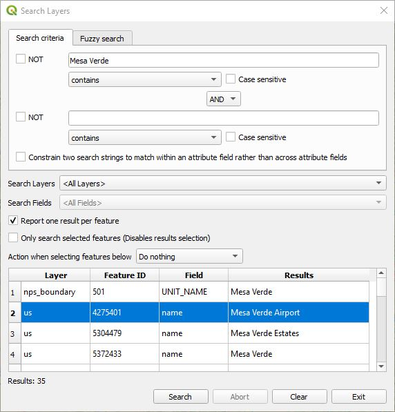
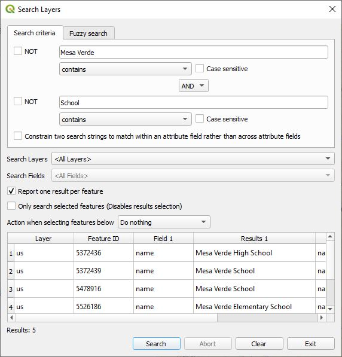
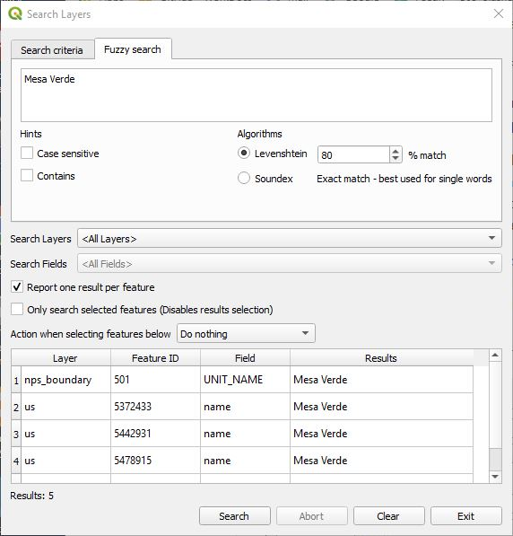

# Search Layers Plugin

The Search Layers plugin features enhanced textual vector layer searching in QGIS. It provides the ability to search across all layers and all fields. It also features a new Fuzzy Search algorithm.

Search Layers is located in the QGIS Plugins menu under *"Plugins->Search Layers->Search Layers"* or by selecting the tool bar icon. 

The following dialog box is displayed when "Search Layers" is first launched.

Under **Search criteria**, you can enter up to two search strings. The **NOT** check box will negate the search results for the applicable string.

Under each search string text box a drop down menu specifies how the search string is to match the contents in the attribute table. The options are: 

* **equals** - This requires an exact match.
* **contains** - This looks for a field that contains the search string.
* **begins with** - This search finds any field that begins with the search string.
* **ends with** - This search finds any field that ends with the search string.

By default the search is case independent, but by checking the **Case sensitive** check box the search string must match the case of the text.

**Search Layers** specifies whether the search will be on *&lt;All Layers&gt;*, *&lt;Selected layers&gt;*, or on any of the vector layers in the QGIS project. If a specific layer is selected then **Search Fields** will be enabled and by default *&lt;All Fields&gt;* will be selected, but any field can be selected from the layer and the search will only search on that layer and field.

It is possible that a search string could match the contents in one or more attribute fields. By checking **Report one result per feature**, only the first match per feature will be reported.

When two search strings are used checking **Constrain two search strings to match within an attribute field rather than across attribute fields** will constrain the search criteria to match within an attribute field; otherwise, one string may match one attribute field and the other string may match another attribute field. The results are either **AND**ed or **OR**ed together. Here is an axample of a two string search.

If **Only search selected features** is checked, the features that are selected in QGIS will be the only ones searched. This is one way to limit a search to a particular area. Note that with this checked, the normal interaction of clicking on a found feature in the list will not select the feature for obvious reasons; however, the zoom or pan to actions will still apply.

Click  the **Search** button to begin the search. In the case of a large data set, clicking on **Abort** will halt the process. Note that the plugin stops after finding 1500 matches.

When matches are found and clicked on the feature(s) will be highlighted. You can you Shift->Click to highlight a range of features, Ctrl->Click to toggle whether a feature is highlighted or not. The drop down menu **Action when selecting features below** controls one of the following motion actions. 

* **Do nothing** - No action takes place.
* **Zoom to selected features** - QGIS will zoom in on the selected features.
* **Pan to selected features** - QGIS will pan to the selected features.

Note that the search is very quick when selecting a single vector layer under **Search Layers** and a single field under **Search Fields**. If this is not the case regular expression searches are used and are very slow. In the future this may change.

## Fuzzy Search

This QGIS plugin makes use of two fuzzy search algorithms. One is based off of the ***Levenshtein*** algorithm and the other is a ***Soundex*** algorithm. The soundex is really only useful for matching single words that sound the same. This is a screen shot.

